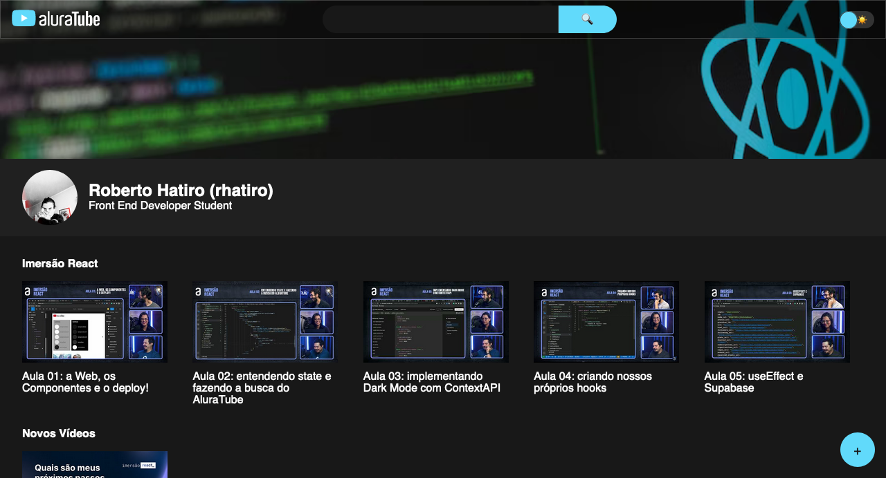
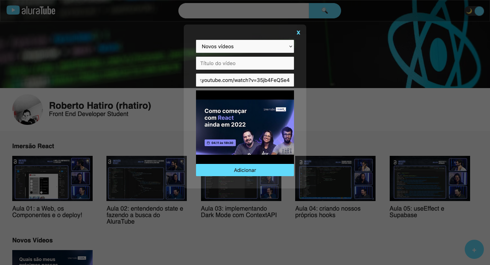
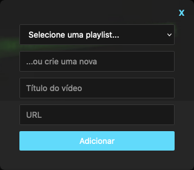

# [AluraTube](https://aluratube-rhatiro.vercel.app/)

## Índice

- [Sobre](#sobre)
  - [Acrescentado posteriormente](#acrescentado-posteriormente-ao-término-das-aulas)
  - [Captura de tela](#captura-de-tela)
- [Desenvolvido com](#desenvolvido-com)
- [Como contribuir ou executar localmente no terminal](#como-contribuir-ou-executar-localmente-no-terminal)
<!-- - [Autor](#autor) -->

_[English version](#table-of-contents)_

## Sobre

Projeto de aprendizado [React](https://reactjs.org/) desenvolvido durante a 5ª edição da ['Imersão React'](https://www.alura.com.br/imersao-react) com foco no framework [Next.js](https://nextjs.org/) realizada pela [Alura](https://www.alura.com.br/) entre os dias 07 e 11 de novembro de 2022.

[AluraTube](https://aluratube-rhatiro.vercel.app/) é inspirado na plataforma [YouTube](https://www.youtube.com/) e tem como objetivo poder armazenar vídeos com conteúdos organizados por playlists novas ou já criadas previamente.

O design original pode ser consultado através deste [link](https://www.figma.com/file/1acrju7CLwHkSh6e7xEk9h/Aluratube?node-id=5%3A2) para o [Figma](https://www.figma.com).

### Acrescentado posteriormente ao término das aulas:

- Customização personalizada;
- Visualização de thumbnail após adicionar URL do vídeo;
- Campo de texto para criação de nova playlist;
- Atualização automática da página e das playlists criadas após adicionar vídeo.

### Captura de tela

<style>
  .container {
    display: flex;
    flex-direction: column;
    align-items: center;
    justify-content: center;
    width: 100%;
  }
  .container img {
    margin: 5px;
    padding: 0 50px;
  }
</style>
<div class="container">
  
  
  
</div>

## Desenvolvido com


## Como contribuir ou executar localmente no terminal

- Instale o [Git](https://git-scm.com/) e o [Node.js](https://nodejs.org) no computador

- #### Clone o projeto

```console
$ https://github.com/rhatiro/aluratube.git
```

- #### Instale as dependências

```console
$ npm i
```

- E então execute o comando `$ npm run dev` para iniciar o servidor local [http://localhost:3000](http://localhost:3000)

<!-- ## Autor
[@rhatiro](https://github.com/rhatiro) -->

---

## Table of contents

- [Overview](#overview)
  - [Added later to the end of classes](#added-later-to-the-end-of-classes)
  - [Screenshots](#screenshots)
- [Built with](#built-with)
- [How to contribute or run locally on terminal](#how-to-contribute-or-run-locally-on-terminal)
<!-- - [Author](#author) -->

_[Versão em português](#índice)_

## Overview

[React](https://reactjs.org/) learning project developed during the 5th edition of ['Imersão React'](https://www.alura.com.br/imersao-react) by [Alura](https://www.alura.com.br/) between November 7th and 11th, 2022 focusing on [Next.js](https://nextjs.org/) framework.

[AluraTube](https://aluratube-rhatiro.vercel.app/) is inspired by the [YouTube](https://www.youtube.com/) platform and aims to store videos with content organized by new playlists or some other previously created.

The original design can be consulted through this [link](https://www.figma.com/file/1acrju7CLwHkSh6e7xEk9h/Aluratube?node-id=5%3A2) for [Figma](https://www.figma.com).

### Added later to the end of classes:

- Personalized customization;
- Thumbnail preview after adding video URL;
- Input to create new playlist;
- Automatically update the page and created playlists after adding a video.

### Screenshots

<div class="container">
  
  
  
</div>

## Built with


## How to contribute or run locally on terminal

- Install [Git](https://git-scm.com/) and [Node.js](https://nodejs.org) on computer

- #### Clone the project

```console
$ https://github.com/rhatiro/aluratube.git
```

- #### Install the dependencies

```console
$ npm i
```

- And then run the command `$ npm run dev` to start local server [http://localhost:3000](http://localhost:3000)

<!-- ## Author
[@rhatiro](https://github.com/rhatiro) -->
